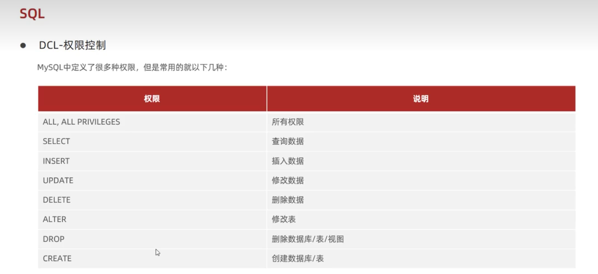

### DCL
#### 一、简介
DCL(Data Control Language) 数据库控制语言用于：
- 管理数据库用户；
- 控制数据库的访问权限。

#### 二、管理用户
##### （一）查询用户
```
USE mysql
SELECT * FROM user;
```
##### （二）创建用户
```
CREATE USER '用户名'@'主机名' IDENTIFIED BY '密码';
```
创建用户 `itcast`，只能在当前主机 `localhost` 访问，密码为 `123456`；
```
create user 'itcast'@'localhost' by '123456';
```

创建用户 `Moon`，可以在任意主机访问该数据库，密码为 `123456`；
```
create user 'Moon'@'%' by '123456';
```
`%` 表示可以在任意主机访问该数据库。
##### （三）修改用户密码
```
ALTER USER '用户名'@'主机名' IDENTIFIED WITH mysql_native_password BY '新密码';
```
修改用户 `Moon`的访问密码为 `1234`；
```
alter user 'Moon'@'%' identified with mysql_native_password by '1234';
```
##### （四）删除用户
```
DROP USER '用户名'@'主机名';
```
删除用户 `itcast`:
```
drop 'itcast'@'localhost';
```
##### （五）注意
- 主机名可以使用 `%` 通配；
- 这类SQL开发人员用的比较少，主要是DBA（数据库管理员）用的比较多。

#### 三、权限控制


##### （一）查询权限
```
SHOW GRANTS FOR '用户名'@'主机名';
```
查询 `Moon` 用户拥有的权限
```
show grants for 'Moon'@'localhost';
```
##### （二）授予权限
```
GRANT 权限列表 ON 数据库.表名 TO '用户名'@'主机'
```
授予用户 `Moon` 操作 `itcast` 数据库中表所有权限：
```
grant all on itcast.* to 'Moon'@'localhost';
```
##### （三）撤销权限
```
REVOKE 权限列表 ON 数据库.表名 FROM '用户名'@'主机'
```
撤销用户 `Moon` 操作 `itcast` 数据库中表所有权限：
```
revoke all on itcast.* from 'Moon'@'localhost';
```
##### 四、注意
- 多个权限之间，用逗号隔开；
- 授权时，数据库名和表名可以使用 `*` 进行通配，代表所有。