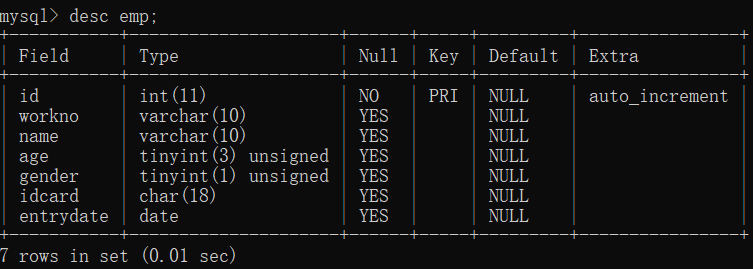
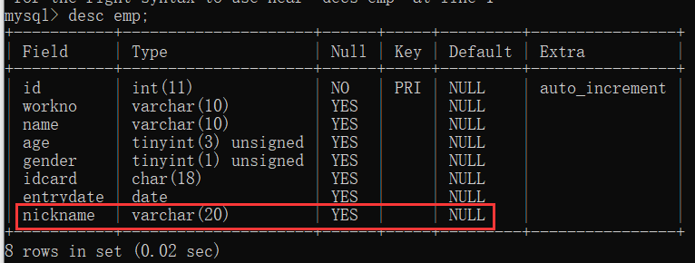
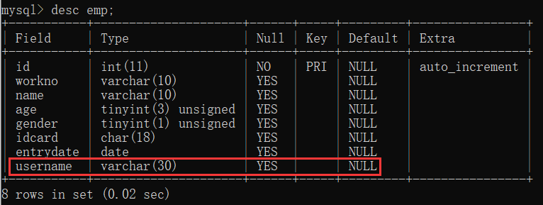
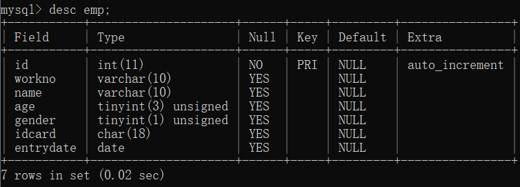
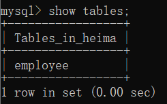

### 表的操作
#### 前期准备
创建一个 `emp` 表，创建表的语句如下：
```
CREATE TABLE `emp` (
  `id` int(11) NOT NULL AUTO_INCREMENT,
  `workno` varchar(10) DEFAULT NULL,
  `name` varchar(10) DEFAULT NULL,
  `age` tinyint(3) unsigned DEFAULT NULL,
  `gender` tinyint(1) unsigned DEFAULT NULL,
  `idcard` char(18) DEFAULT NULL,
  `entrydate` date DEFAULT NULL,
  PRIMARY KEY (`id`)
) ENGINE=MyISAM DEFAULT CHARSET=utf8 |
```
表结构如下：



#### 添加字段
```
ALTER TABLE 表名 ADD 字段名 类型（长度）[COMMENT 注释][约束]
```
案例：为 `emp` 表中添加一个新的字段“昵称”（nickname），数据类型为 `varchar(20) `；
```
alter table emp add nickname varchar(20);
```
在命令行中输入该命令后：


#### 修改字段
##### （一）修改数据类型
```
ALTER TABLE 表名 MODIFY 字段名 新数据类型（长度）
```
##### （二）修改字段名和字段类型
```
ALTER TABLE 表名 CHANGE 旧字段名 新字段名 类型（长度）[COMMENT 注释][约束]
```
#### （三）案例
将表中的 `nickname` 修改为 `username`，类型为 varchar(30)

既要修改表字段名又要修改字段类型：
```
alter table emp change nickname username varchar(30);
```
结果如下:


#### 删除字段
```
ALTER TABLE 表名 DROP 字段名;
```
案例：删除 `emp` 表中的 `username` 字段：
```
alter table emp drop username;
```
运行命令，结果如下：


表中的 `username` 字段已经被删除了。
#### 修改表名
```
ALTER TABLE 表名 RENAME TO 新表名;
```
案例：将 `emp` 表的表名修改为 employee。
```
alter table emp rename to employee;
```
运行命令，查看表名：



#### 删除表
##### （一）删除表
```
DROP TABLE [IF EXISTS] 表名
```
##### （二）删除指定表，并重新创建该表
```
TRUNCATE TABLE 表名;
```
注意：在删除表时，表中的数据会被全部删除掉；