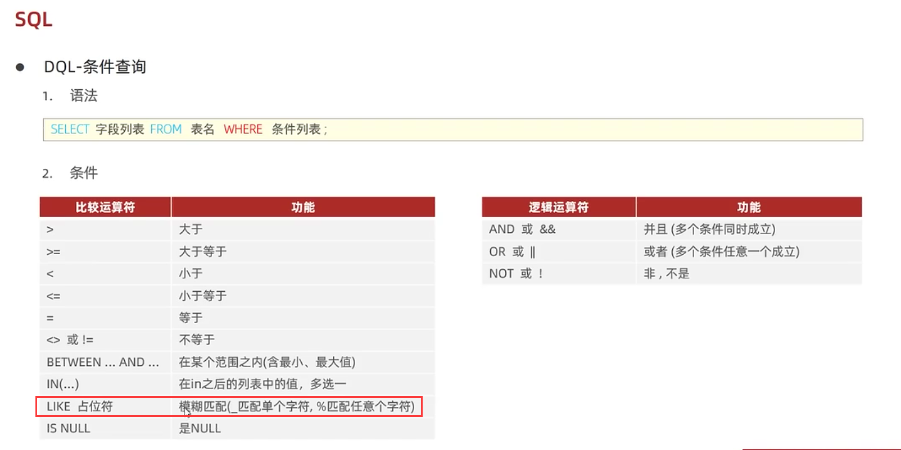

### 条件查询
#### 一、语法
```
SELECT 字段列表FROM表名WHERE条件列表;
```
#### 二、条件


模糊查询
查询姓名为两个字的员工信息
```
select * from emp where name like '__';
```
查询身份证号最后一位是X的员工信息
```
select * from emp where idcard like '%X';
```