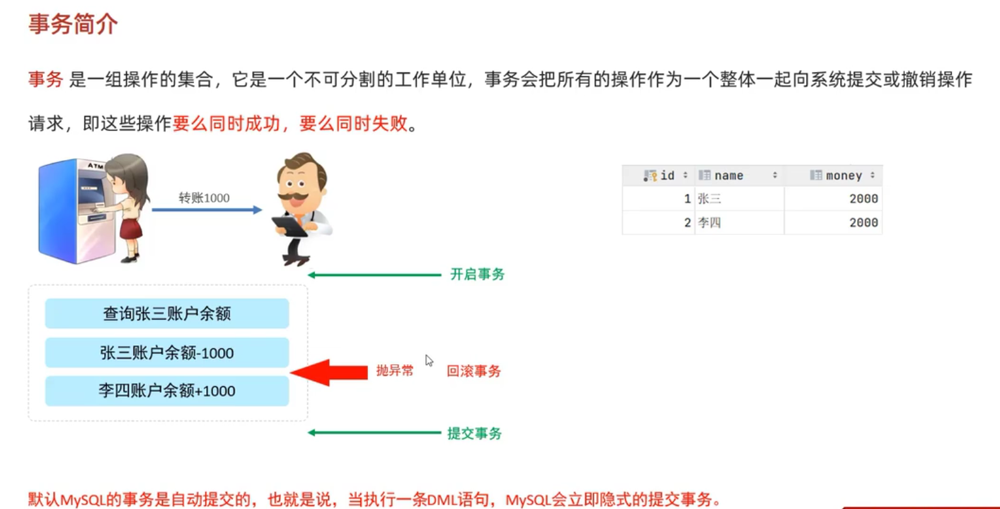

### 事物

#### 事物简介
> 事物是一组操作的集合，它是一个不可分割的工作单位，事物会把所有的操作作为一个整体向系统提交或撤销请求，即这些操作要么同时成功，要么同时失败。

#### 银行转账
张三从自己的账户里转 1000 给李四：
1. 查询张三的账户，以判断张三能否转 1000 出去；
2. 如果张三的存款大于 1000，则在张三的账户中减去 1000；
3. 李四的账户中增加 1000；
   

正常情况下，这三条语句会依次执行，但是如果在执行完第二条语句之后抛出了异常，就会出现，张三转出 1000，李四的账户并未增加 1000 的情况。

这种现象被称为消失的 1000 块。

这种情况显然是不被允许的，为了避免这种问题，就要引入今天的主题——**事物**。

把这三条语句当做一个整体，要么全部执行成功，要么全部不执行。