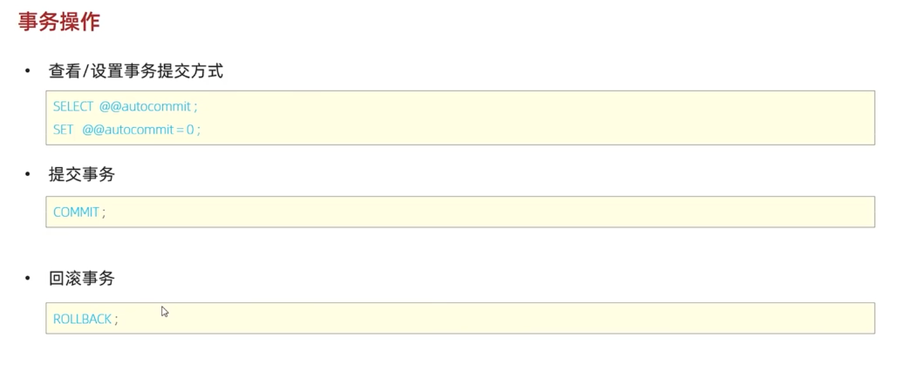
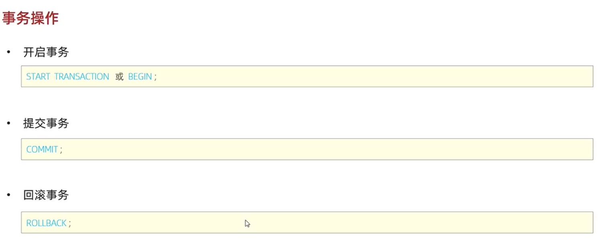

### 事物操作
#### 查看/设置事物提交方式


mysql 默认的提交方式为 1，也就是自动提交事物。

把自动提交改为手动提交的语句：
```
set @@autocommit = 0
```
#### 开启事物


开启事物的语句：
```
START TRNSACTION
```
#### 提交事物
```
commit
```
#### 回滚事物
```
rollback
```
