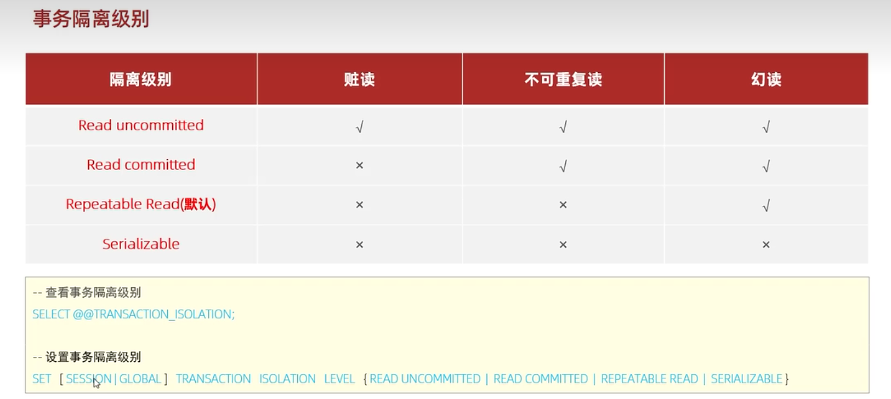

### 隔离级别
#### 隔离级别的分类


- Read uncommitted；
- Read committed；
- Repeatable Read(默认)：可重复读；
- Serializable。


安全性和并发性能的权衡。

#### 查看隔离级别
```
select @@transaction_isolation
```
@@ => 查看系统变量

#### 设置隔离级别
```
SET [SESSION/GLOBAL] TRANSACTION I5OLATION LEVEL {READUNCOMMITED |READCOMMITED |REPEATABLE READ |SERALZABLE}
```
- SESSION 指的是对当前会话窗口有效；
- 对所有客户端有效。