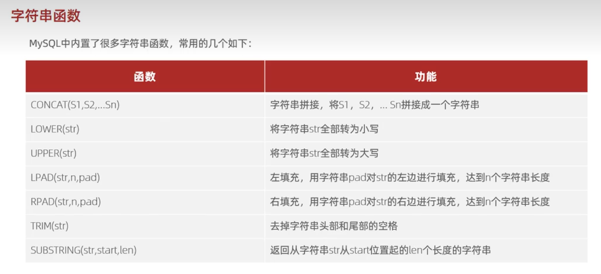

### 字符串函数
#### 常用字符串函数


1. 拼接（concat）
2. 填充（pad）
3. 大小写转换（lower、upper）
4. 截取（substring）
5. 修剪（trim）


#### 示例
拼接 `hello` 和 `world`
```
select concat('hello','world'); // helloworld
```
将小写字母全部转换为大写字母
```
select upper('hello'); // HELLO
```
将大写字母全部转换为小写字母
```
select lower('Hello'); // hello
```
用 `0` 在 `1` 的右边填充到 `5` 的长度：
```
select rpad(1,5,0);
```
用 `0` 在 `1` 的左边填充到 `5` 的长度：
```
select rpad(1,5,0);
```
截取字符串 `Hello world`，从 `1` 开始，长度为 `5`;
```
select substring('hello world',1,5); // hello
```
注意：字符串的下标是从 `1` 开始，而非从 `0` 开始。

#### 案例
由于业务需求变更，企业员工的工号，统一为 5 位数，目前不足 5 位数的全部在前面补 0，例如：1 号员工的工号应该为 00001。

`emp` 表的 `workno` 字段：
|workno|
|:----:|
|1|
|2|
|3|
|...|
|11|
```
update emp set workno = lpad(workno,5,'0');
```
|workno|
|:----:|
|00001|
|00002|
|00003|
|...|
|00011|