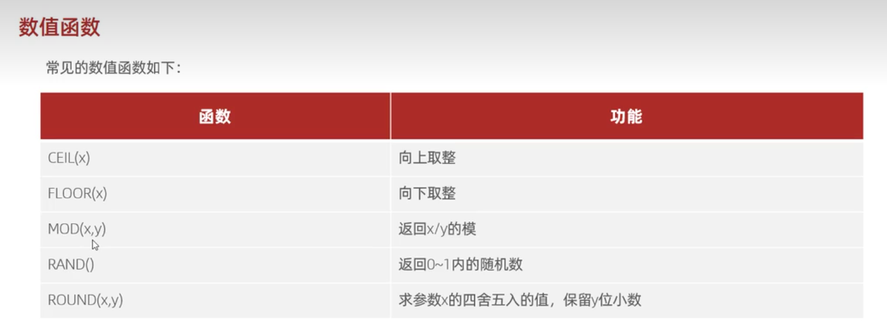

### 数值函数
#### 常见的数值函数


1. 向上/下取整（ceil/floor）；
2. 取模（mod）
3. 随机数（rand）
4. 四舍五入 （round）

#### 用法
ceil
```
select ceil(2.3); // 3
```
floor
```
select floor(2.3); // 2
```
mod
```
select mod(2,3); // 2
```
rand
```
select rand(); // 0.18321099894420337
```
round
```
select round(2.3); // 2
select round(2.5); // 3
```
注意：rand 的值介于 `0` 和 `1` 之间。

#### 案例
通过数据库的函数，生成一个六位数的随机验证码。
```
select lpad(round(rand()*1000000,0),6,'0');
```