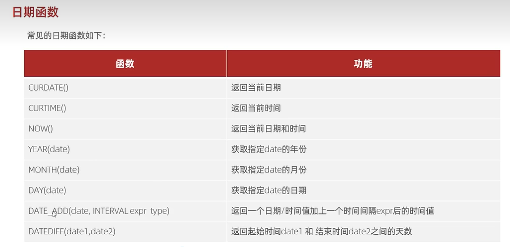

### 日期函数
#### 常见的日期函数


#### 用法
返回当前日期
```
select curdate();// 2022-09-28
```
返回当前时间
```
select curtime();// 22:22:22 也太巧了吧:)
```
返回当前日期和时间
```
select now(); // 2022-09-28 22:23:49
```
获取指定 `date` 的年份
```
select year(now()); // 2022
```
获取指定 `date` 的月份
```
select month(now()); // 9
```
获取指定 `date` 的日期
```
select day(now()); // 28
```
返回 30 天后的日期
返回 30 个月后的日期
返回 30 年后的日期
```
select date_add(now(),INTERVAL 30 DAY); //  2022-10-28 22:29:27
select date_add(now(),INTERVAL 30 MONTH); // 2025-03-28 22:30:01
select date_add(now(),INTERVAL 30 YEAR); // 2052-09-28 22:30:30
```
计算起始日期和结束日期间隔的天数（差值）
```
select datediff(now(),'2022-10-01'); // -3 
select datediff('2022-10-01',now()); // 3 
```
第一个时间减去第二个时间

#### 案例
查询所有员工的入职天数，并根据入职天数倒序排序。emp 表如下：
|id|name|entrydate|
|:----:|:----:|:----|
|1|Moon|2022-9-1|
|2|Shadow|2022-9-2|
```
select 
name,
datediff(now(),entrydate) as entrydays
from emp 
order by entrydays desc;
```