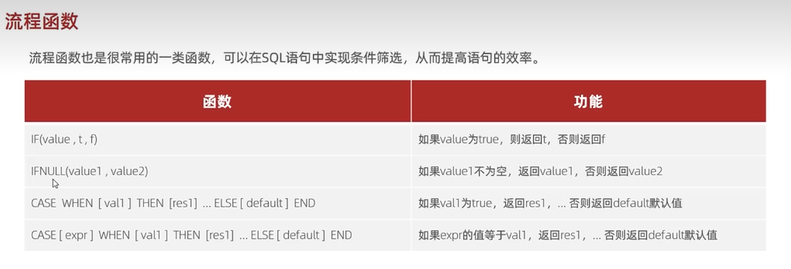

### 流程函数
#### 常见的流程函数


1. if
2. case when then
#### 用法
如果髫年为真返回 `success`，否则返回 `error`
```
select if(true,'success','error'); // success
select if(false,'success','error'); // error
```
ifnull
```
select ifnull(null,'hello'); // hello
select ifnull('ok','hello'); // ok
select ifnull('','hello'); // 
```
注意：
- 只有当 val1 为 null 时返回 val2 的值，否则返回 val1 的值；
- 空字符串不为 null。 

case when then else end
查询 `emp` 表中员工姓名和工作地址（北京/上海 ---> 一线城市，其他 ---> 二线城市），`emp` 表如下：
|id|name|address|
|:----:|:----|:----|
|1|小何|上海|
|2|小白|北京|
|3|小黑|上海|
|4|菜鸟|江西|
|5|大师|深圳|

```
select
name,
(case address when '北京' then '一线城市' when '上海' then '一线城市' else '二线城市' end) as workaddress
from emp;
```
结果：
| name | workaddress |
|:----:|:----|:----|
|小何|一线城市|
|小白|一线城市|
|小黑|一线城市|
|菜鸟|二线城市|
|大师|二线城市|

#### 案例
统计班级各个同学的成绩，展示的规则如下：
- \>80 优秀；
- \>60 及格；
- 否则 不及格。

score 表如下： 
|id | math  | english | chinese | name |
|:----:|:----|:----|:----|:----|
|1|74.00|83.00|90.00|小何|
|2|59.00|72.00|65.00|小白|
|3|89.00|90.00|75.00|Moon|

```
select 
name,
(case when math>80 then '优秀'when math > 60 then '及格' else '不及格' end) as '数学',
(case when english>80 then '优秀'when english > 60 then '及格' else '不及格' end) as '英语',
(case when chinese>80 then '优秀'when chinese > 60 then '及格' else '不及格' end) as '语文'
from score;
```
结果如下：
|name| math  | english | chinese |
|:----:|:----|:----|:----|:----|
|小何|及格  |优秀|优秀|
|小白|不及格|及格|及格|
|Moon|优秀  |优秀| 及格|