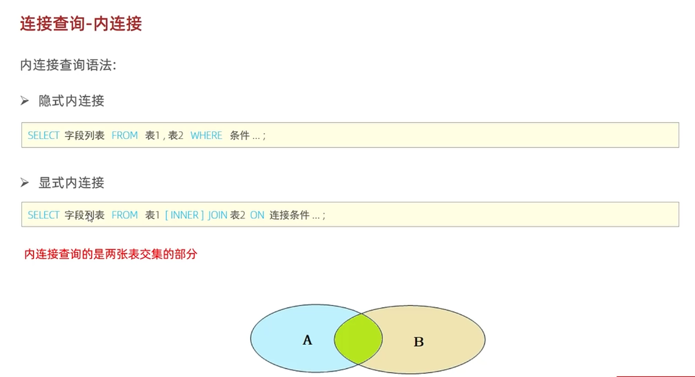

### 内联结
#### 查询语法


隐式内联结
```
SELECT 字段列表 FROM 表1,表2 WHERE 联结条件...
```
显示内联结
```
SELECT 字段列表 FROM 表1 [INNER] JOIN 表2 ON 联结条件
```
#### 案例
查询每一个员工的姓名，及关联部门的名称。
- 员工表：emp；
- 部门表：dep；
- 联结条件：emp.dep_id = dep.id。（emp 表的外键等于 dep 表的主键）

显示外联结用的比较多，所以就用较不熟悉的隐式内联结来完成案例的查询：
```
select emp.name,dep.name from emp,dep where emp.dep_id = dep.id;
```
#### 查询结果
内联结查询的是两张表交集的部分。