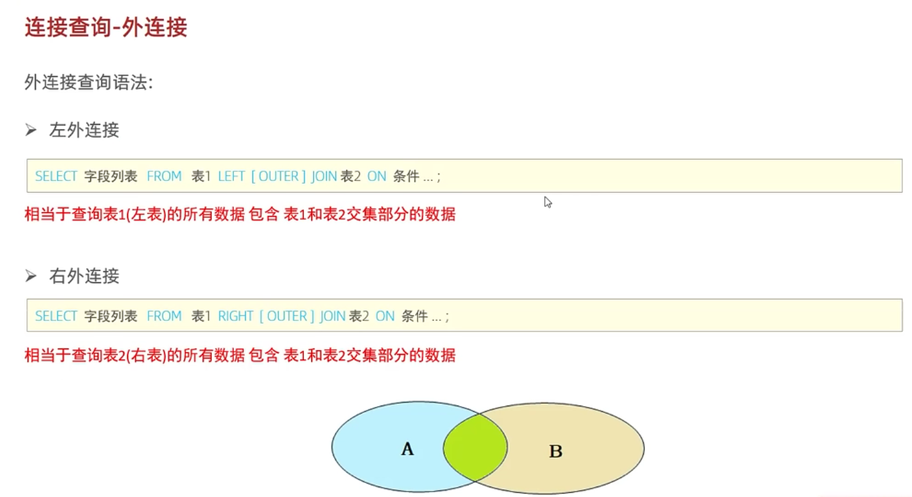

### 外联结
#### 查询语法


左外联结
```
SELECT 字段列表 FROM 表1 LEFT [OUTER] JOIN 表2 ON 联结条件;
```
右外联结
```
SELECT 字段列表 FROM 表1 RIGHT [OUTER] JOIN 表2 ON 联结条件;
```
#### 查询结果
- 左联结相当于查询左表所有的数据，包含左表和右表交集部分的数据；
- 右联结相当于查询右边表所有的数据，包含左表和右表交集部分的数据。
