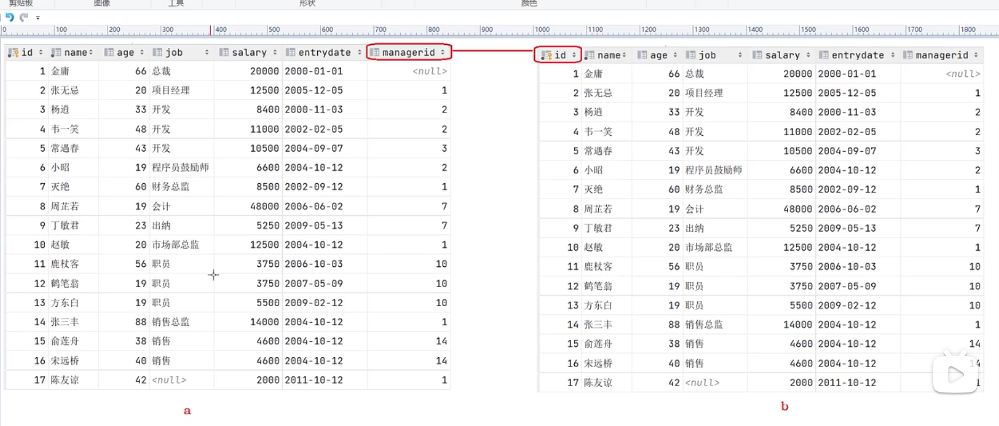

### 自联结
#### 查询语法


```
select 字段列表 FROM 表A 别名A JOIN 表A 别名B ON 联结条件;
```
#### 案例
案例1，查询员工及其领导的名字，emp 表如下（内联自联结）：
|id|name|address|manger_id|
|:----:|:----|:----|:----:|
|1|小何|上海|0|
|2|小白|北京|4|
|3|小黑|上海|2|
|4|菜鸟|江西|5|
|5|大师|深圳|1|

SQL 语句：
```
select 
a.name,
b.name manger_name 
from emp a join emp b 
on a.manger_id = b.id;
```
结果：
|name| manger_name|
|:----:|:----:|
| 小白 | 菜鸟        |
| 小黑 | 小白        |
| 菜鸟 | 大师        |
| 大师 | 小何        |

注意：自联结的关联条件：

即：表 A 的 `manger_id` 等于 表 B 的 `id`。

案例2，查询员工及其领导的名字，即使没有领导，也要查询出来（外联自联结）：
```
select 
a.name,b.name manger_name
from emp a left join emp b 
on a.manger_id = b.id;
```
|name| manger_name|
|:----:|:----:|
| 小何 | NULL        |
| 小白 | 菜鸟        |
| 小黑 | 小白        |
| 菜鸟 | 大师        |
| 大师 | 小何