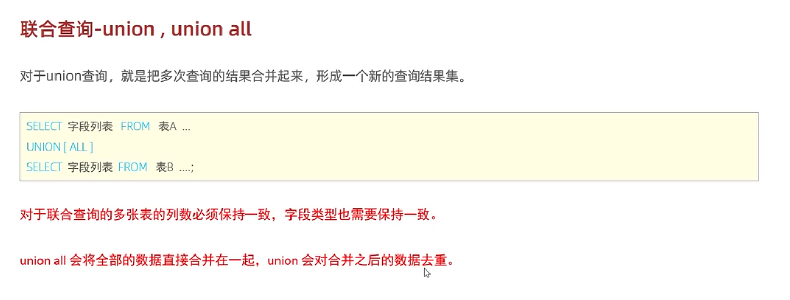

### 联合查询

#### 查询语句


```
SELECT 字段列表 FROM 表A...
UNION [ALL]
SELECT 字段列表 FROM 表B...
```
#### 查询结果
把多次查询的结果合并起来，形成一个新的查询结果集。
#### 前提条件
对于联合查询，多张表的列数必须保持一致，字段类型也需要保持一致。
#### union 和 union all 的区别
- union all 会将数据直接合并在一起；
- union 会对合并的数据去重。