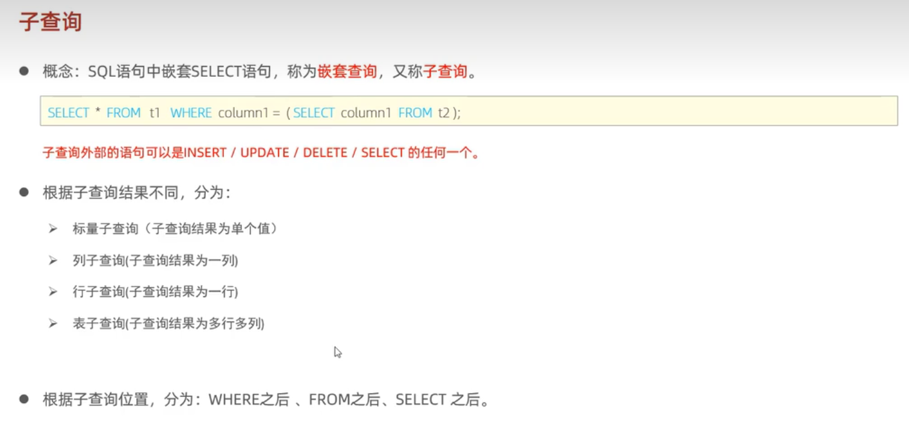
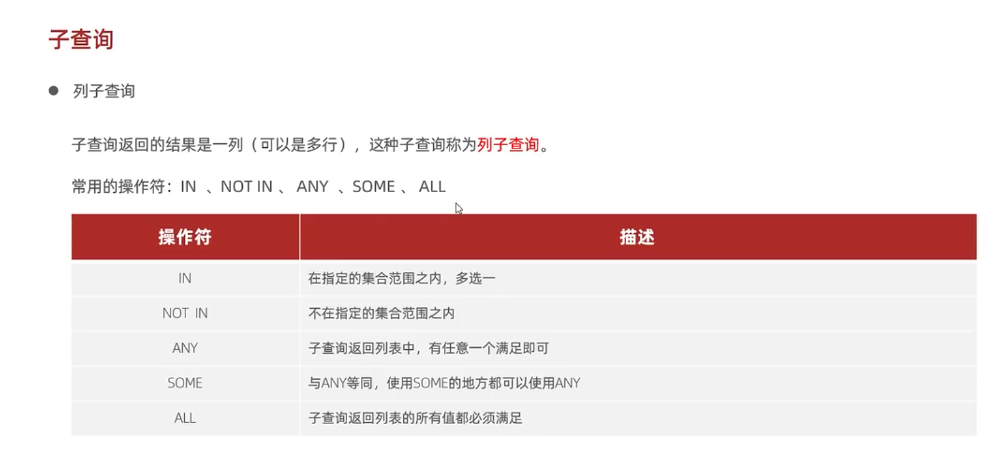
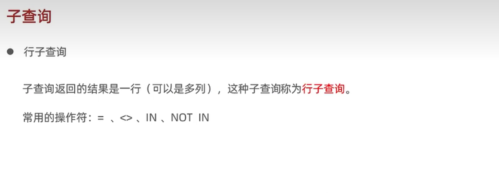

### 子查询


#### 分类
根据子查询结果不同，可以分为：
- 标量子查询（子查询结果为单个值）；
- 列子查询（子查询结果为一列）；
- 行子查询（子查询结果为一行）；
- 表子查询（子查询结果为多行多列）。

根据查询位置，可以分为：
- where 之后；
- from 之前；
- select 之后。

#### 标量子查询
> 子查询返回的结果是单个值（数字、字符串、日期等），最简单的形式，这种子查询称为标量子查询。

常用的操作符：=、<>、>、>=、<、<=

案例：查询在“东方白”入职之后的员工信息。
1. 查询“东方白”的入职日期；
2. 查询指定入职日期之后入职的员工信息。

```
// 1. 查询“东方白”的入职日期；
select entrydate from emp where name="东方白"; // 2022-10-5
// 2. 查询指定入职日期之后入职的员工信息。
select * from emp where entrydate > '2022-10-5';
// 子查询
select * from emp where entrydate > (select entrydate from emp where name="东方白");
```

#### 列子查询


> 子查询返回的结果是一列，这种子查询称为列子查询；

常用的操作符：IN、NOT 、IN、ANY、SOME、ALL。
- ANY：子查询返回列表中，有任意一个满足即可；
- SOME：与 ALL 等同，使用 SOME 的地方都可以使用 ANY；
- ALL 子查询返回列表的所有值都必须满足。

案例：查询比研发部其中**任意**一人工资高的员工信息。
emp 表如下：

| id | name | address | manger_id | salary   | dep_id |
|:----:|----:|:----:|:----:|:----:|:----:|
|  1 | 小何 | 上海    |         0 | 10000.00 |      1 |
|  2 | 小白 | 北京    |         4 |  4000.00 |      1 |
|  3 | 小黑 | 上海    |         2 |  5000.00 |      2 |
|  4 | 菜鸟 | 江西    |         5 |  6000.00 |      3 |
|  5 | 大师 | 深圳    |         1 |  7000.00 |      2|
研发部表如下：

| id | name   |
|:----:|:----:|
|  1 | 研发部 |
|  2 | 采购部 |
|  3 | 营销部|

查询步骤如下：
1. 查询研发部门所有人的工资；
2. 比研发部其中任意一人工资高的员工信息。

```
// 1. 查询研发部门所有人的工资；
select salary from emp where dep_id = (select id from dep where name = "研发部");
// 2. 比研发部其中任意一人工资高的员工信息。
select * from emp where salary > any (select salary from emp where dep_id = (select id from dep where name = "研发部"));
```
结果：
| id | name | address | manger_id | salary   | dep_id |
|:----:|----:|:----:|:----:|:----:|:----:|
1 | 小何 | 上海    |         0 | 10000.00 |      1 |
|  3 | 小黑 | 上海    |         2 |  5000.00 |      2 |
|  4 | 菜鸟 | 江西    |         5 |  6000.00 |      3 |
|  5 | 大师 | 深圳    |         1 |  7000.00 |      2 |

只要工资比研发部最少工资高的员工都会查询出来。

#### 行子查询


> 子查询返回的结果是一行（可以是多列），这种子查询称为行子查询。

常用的操作符：=、<>、INT、NOT IN

案例：查询与 “Moon” 的薪资及直属领导相同的员工信息。
emp 表如下：
| id | name | address | manger_id | salary   | dep_id |
|:----:|----:|:----:|:----:|:----:|:----:|
|  1 | 小何 | 上海    |         0 | 10000.00 |      1 |
|  2 | 小白 | 北京    |         4 |  4000.00 |      1 |
|  3 | 小黑 | 上海    |         2 |  5000.00 |      2 |
|  4 | 菜鸟 | 江西    |         5 |  6000.00 |      3 |
|  5 | 大师 | 深圳    |         1 |  7000.00 |      2|
|6 | Moon | 四川    |         1 |  7000.00 |      2 |

查询步骤：
1. 查询 “Moon” 的薪资及直属领导；
2. 查询与 “Moon” 的薪资及直属领导相同的员工信息。
```
// 1. 查询 “Moon” 的薪资及直属领导；
select salary, manger_id from emp where name="Moon";
// 2. 查询与 “Moon” 的薪资及直属领导相同的员工信息。
select * from emp where (salary,manger_id) = (7000.00,2);
// 子查询：
select * from emp where (salary,manger_id) = (select salary, manger_id from emp where name="Moon");
```
结果：
| id | name | address | manger_id | salary   | dep_id |
|:----:|----:|:----:|:----:|:----:|:----:|
5 | 大师 | 深圳    |         1 | 7000.00 |      2 |
|  6 | Moon | 四川    |         1 | 7000.00 |      2 |

#### 表子查询
> 表子查询返回的结果是多行多列，这种子查询被称为表子查询。

常用的操作符：IN。

案例：查询与 “Shadow” 和 “小何” 的 `address` 和 薪资相同的员工信息。
emp 表结构
| id | name | address | manger_id | salary   | dep_id |
|:----:|----:|:----:|:----:|:----:|:----:|
|  1 | 小何   | 上海    |         0 | 10000.00 |      1 |
|  2 | 小白   | 北京    |         4 |  4000.00 |      1 |
|  3 | 小黑   | 上海    |         2 |  10000.00 |      2 |
|  4 | 菜鸟   | 江西    |         5 |  6000.00 |      3 |
|  5 | 大师   | 深圳    |         1 |  7000.00 |      2 |
|  6 | Moon   | 四川    |         1 |  7000.00 |      2 |
|  7 | Shadow | 深圳    |         1 |  7000.00 |      1 |

查询步骤：
1. 查询 “Shadow” 和 “小何” 的 `address` 和 薪资；
2. 查询与 “Shadow” 和 “小何” 的 `address` 和 薪资相同的员工信息。

```
// 1. 查询 “Shadow” 和 “小何” 的 `address` 和 薪资；
select address,salary from emp where name = "Shadow" or name = "小何";
// 2. 查询与 “Shadow” 和 “小何” 的 `address` 和 薪资相同的员工信息。
select * from emp where (address,salary) in (select address,salary from emp where name = "Shadow" or name = "小何");
```
结果：
| id | name | address | manger_id | salary   | dep_id |
|:----:|----:|:----:|:----:|:----:|:----:|
|  1 | 小何   | 上海    |         0 | 10000.00 |      1 |
|  3 | 小黑   | 上海    |         2 | 10000.00 |      2 |
|  5 | 大师   | 深圳    |         1 |  7000.00 |      2 |
|  7 | Shadow | 深圳    |         1 |  7000.00 |      1 |

案例2：查询薪资小于 7000 的员工信息及其部门信息。
emp 表如下：
| id | name | address | manger_id | salary   | dep_id |
|:----:|----:|:----:|:----:|:----:|:----:|
|  1 | 小何   | 上海    |         0 | 10000.00 |      1 |
|  2 | 小白   | 北京    |         4 |  4000.00 |      1 |
|  3 | 小黑   | 上海    |         2 |  10000.00 |      2 |
|  4 | 菜鸟   | 江西    |         5 |  6000.00 |      3 |
|  5 | 大师   | 深圳    |         1 |  7000.00 |      2 |
|  6 | Moon   | 四川    |         1 |  7000.00 |      2 |
|  7 | Shadow | 深圳    |         1 |  7000.00 |      1 |
查询步骤：
1. 查询出薪资小于 7000 的员工信息；
2. 查询出这部分员工，对应的部门信息。

```
// 1. 查询出薪资小于 7000 的员工信息；
select * from emp where salary < 7000;
// 2. 查询出这部分员工，对应的部门信息。
select e.*,d.* from (select * from emp where salary < 7000) e left join dep d on e.dep_id = d.id;
```
结果：
 id | name | address | manger_id | salary  | dep_id | id   | name
|:----:|----:|:----:|:----:|:----:|:----:|:----:|:----:|
| 2 | 小白 | 北京    |         4 | 4000.00 |      1 |    1 | 研发部 |
|  4 | 菜鸟 | 江西    |         5 | 6000.00 |      3 |    3 | 营销部|
