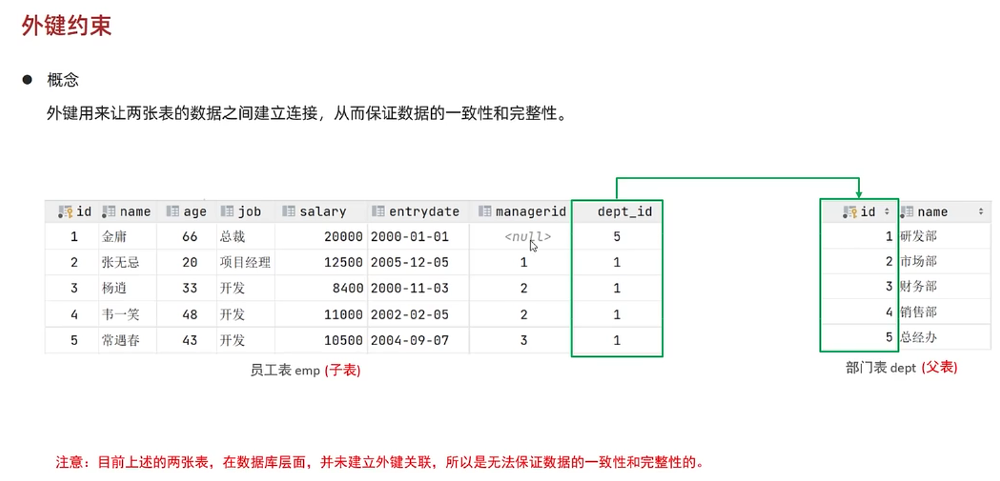
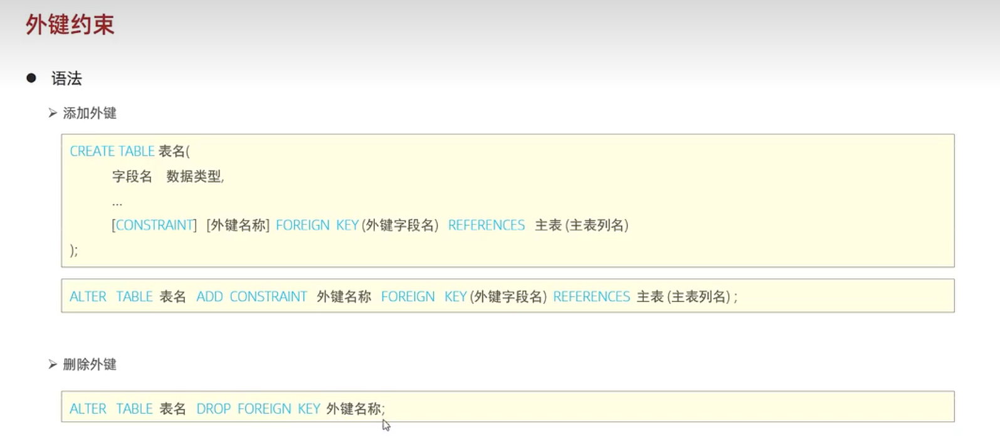

### 外键约束
#### 作用


> 外键用来让两张表建立联系，从而保证数据的一致性和完整性
#### 外键的增加和删除


增加
```
alter table 表名  add constraint 外键名称 foreign key(外键字段名) reference 主表(主表列名) 
```
例子，一个班级有多个学生
```
alter table student add contraint fk_stu_class_id foreign key(class_id) reference class(id);
```

删除
```
alter table 表名 drop foreign key 外键名称
```
例子，删除 student 表中的外键：
```
alter table student drop foreign key fk_sut_class_id;
```