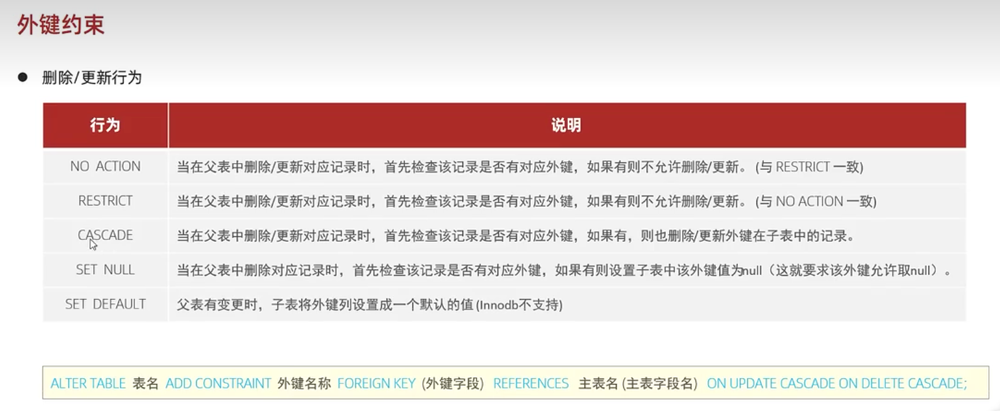

### 外键约束的更新和删除
#### 更新和删除


三类：
- 严格模式，不允许更新和删除；（默认模式）
- 关联模式，有外键时，删除或更新父表中的记录时，也会删除或更新外键在子表中的记录；
- 空值模式，当删除父表中的记录时，如果有外键，子表中的外键为 null（这就要求该外键允许为 null）

设置关联模式：
```
alter table 表名  add constraint 外键名称 foreign key(外键字段名) reference 主表(主表列名) on update cascade on delete cascade;
```