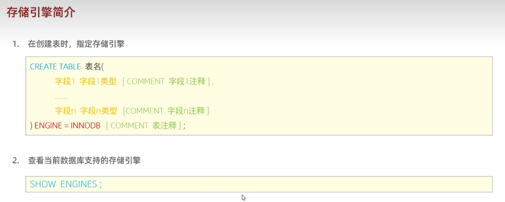
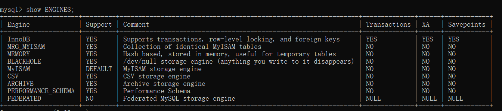

### 存储引擎简介
需要搞明白两个问题：
1. 什么是存储引擎？
2. 如何指定存储引擎？
#### 什么是存储引擎
存储引擎可以理解为发动机，是一个机器的核心。

不同的存储引擎有不同的应用场景，没有绝对的好坏之分。

就像你不能把火箭的发动机安装到直升机上。
#### 指定存储引擎


建表时，指定存储引擎：
```
CREATE TABLE xxx(
    字段1 字段1 类型 [COMMENT 字段1注释],
    ...
    字段n 字段n 类型 [COMMENT 字段n注释]
)ENGINE = INNODB[COMMENT 表注释];
```
查看当前数据库支持的存储引擎
```
SHOW ENGINES;
```
结果：


查看已经创建表的存储引擎
```
show create table 表名;
```
查看 account 表的存储引擎
```
show create table account;
```
结果：
```
CREATE TABLE `account` (
  `id` int(11) NOT NULL AUTO_INCREMENT,
  `name` varchar(50) COLLATE utf8_unicode_ci DEFAULT NULL,
  `money` int(11) DEFAULT NULL,
  PRIMARY KEY (`id`)
) ENGINE=MyISAM AUTO_INCREMENT=3 DEFAULT CHARSET=utf8 COLLATE=utf8_unicode_ci
```
版本为 `5.7.26` 的 MySQL 默认的存储引擎为 `MyISAM`。