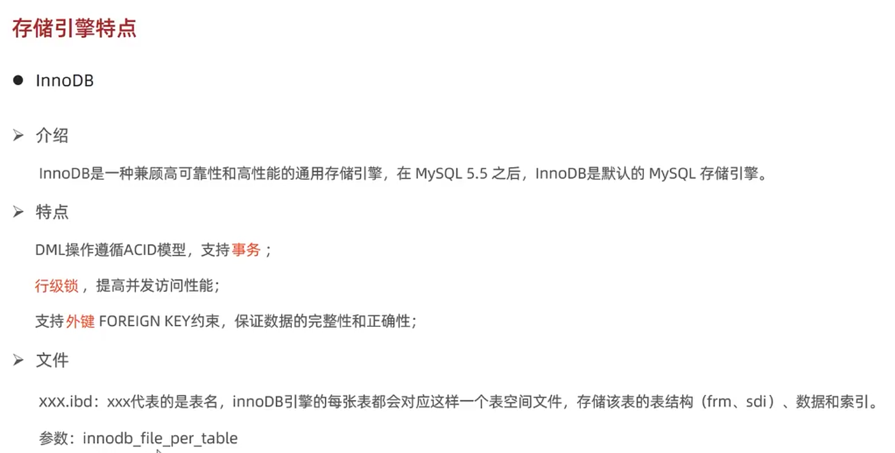
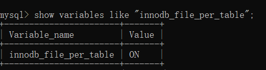
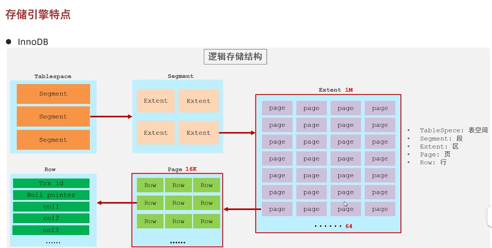

### InnoDB简介
目的：
- 分清 InnoDB、MySIAM、Memory 的特点及区别。



#### 介绍
> InnoDB 是一种兼顾高可靠性和高性能的通用存储引擎，在 MySQL 5.5 之后，InnoDB 是默认的 MySQL 存储引擎（存在疑问）。 

关键字：高可靠性、高性能

#### 特点：
- DML操作遵循ACID（原子性、一致性、隔离性、持久性）模型，支持**事务**;
- **行级锁**，提高并发访问性能;
- 支持**外键**FOREIGN KEY约束，保证数据的完整性和正确性。

关键字：事物、行级锁、外键

#### 文件
xxx.ibd: xxx代表的是表名，innoDB引擎的每张表都会对应这样一个表空间文件，存储该表的表结构(frm、sdi)、数据和索引。
参数: innodb_file_per_table
```
show variables like "innodb_file_per_table"
```
结果：


值为 ON，即是打开的（默认是打开的），意味着每张表对应一个表空间。

#### 逻辑存储结构


大概描述一下这张图：
- 一个表空间（TableSpace）包含若干个段（Segment）；
- 一个段包含若干个区（Extent）；
- 一个区包含若干个页（Page）；
- 一个页包含若干行（Row）。

一个区的大小是固定的，1M，一个页的大小也是固定的 16k，也就是说一个区可以包含64个页；
