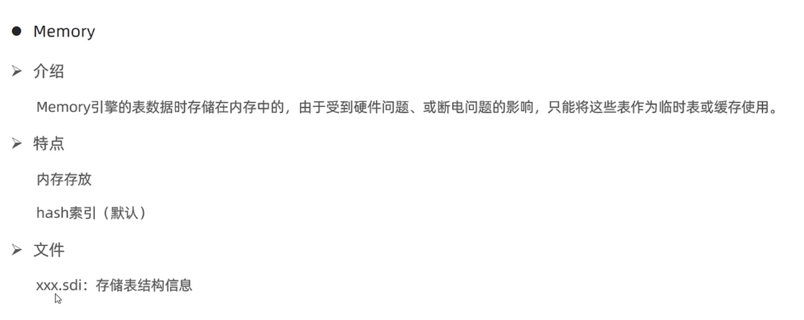

### MyISAM 和 Memory 简介
#### 一、MyISAM 简介

##### （一）介绍
> MyISAM 是 MySQL 早期的默认存储引擎。

##### （二）特点
- 不支持事物，不支持外键；
- 支持表锁，不支持行锁；
- 访问速度快；

##### （三）文件
- xxx.sdi 存储表结构信息；
- xxx.MYD 存储数据；
- xxx.MYI 存储索引。

#### 二、Memory 简介

##### （一）介绍
> Memory 引擎的表数据存储在内存中的，由于受到硬件问题，或断电的影响，只能将这些表作为临时表或缓存使用；

##### （二）特点
- 内存存放；
- hash 索引（索引）。

##### （三）文件
xxx.sdi 存储表结构信息

#### 三、InnoDB、MyISAM 和 Memory 同与异
