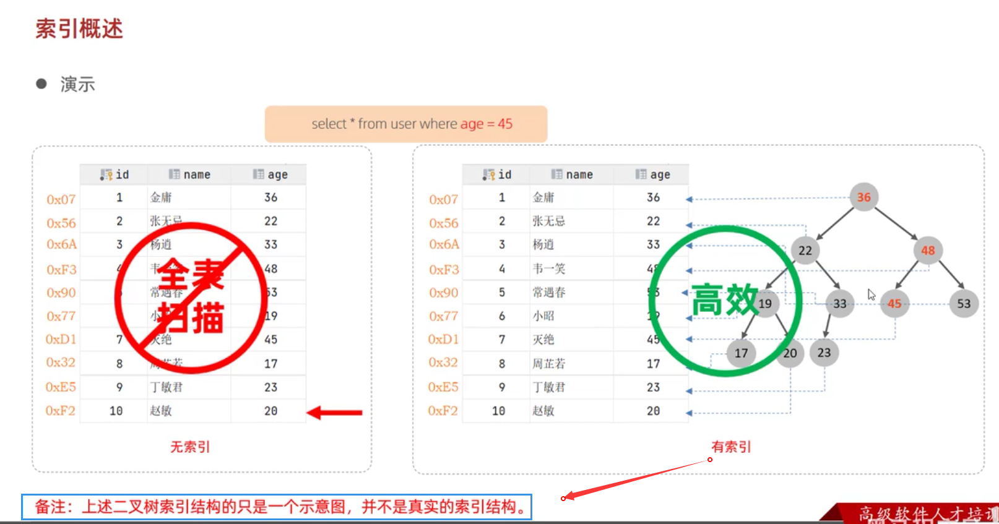

### 索引概述
#### 什么是索引
> 索引(index)是帮助MysQL高效获取数据的数据结构(有序)。在数据之外，数据库系统还维护着满足特定查找算法的数据结构，这些数据结构以某种方式引用（指向）数据，这样就可以在这些数据结构上实现高级查找算法，这种数据结构就是索引。

**索引(index)是帮助MysQL高效获取数据的数据结构(有序)**

#### 演示

#### 优缺点

优点：
- 提高查询效率；
- 提高排序效率。

缺点：
- 索引需要占用磁盘空间；
- 降低更新表的速度。

当考虑使用索引时，一般可以忽略这两个缺点：
- 现在磁盘非常便宜；
- 对于一个正常的业务系统来说，增删改并不频繁，主要是查询操作。