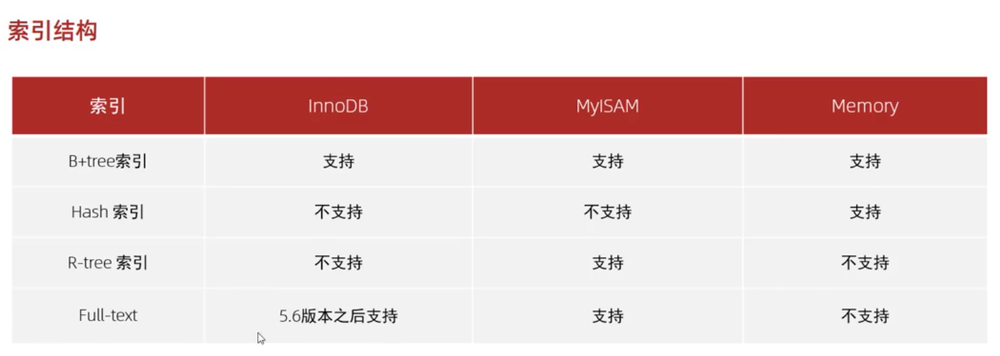

### 索引结构
#### 常见结构

常见的索引结构：
- B+Tree 索引：最常见的索引类型，大部分存储引擎都支持 B+ 索引；（需重点掌握）
- Hash 索引：只有精确匹配索引查询才有效，**不支持范围查询**；（需掌握）
- R-tree（空间索引）：主要用于存储地理空间数据类型，通常使用较少；（了解即可）
- Full-text（全文索引）：是一种通过建立倒排索引，快速匹配文档的方式。（了解即可）
#### 支持情况
