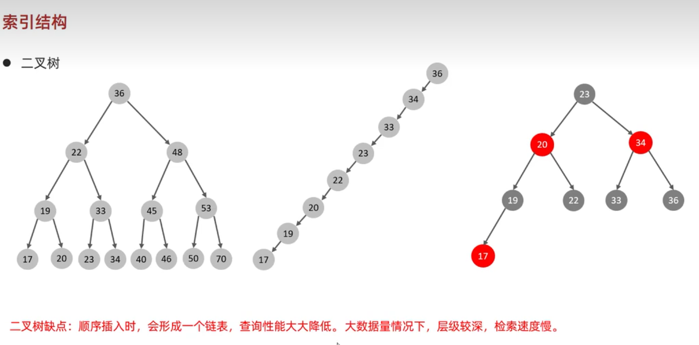
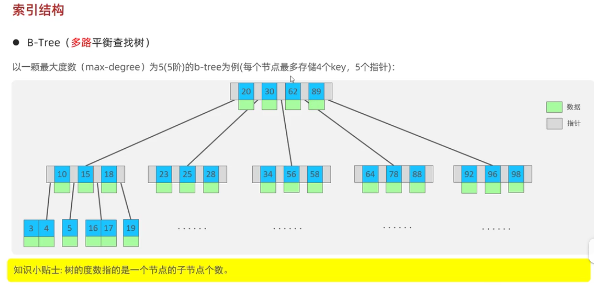

### B-Tree 结构
使用二叉树来存储数据可以大大地减低查询的次数，从而提高查询的效率，但是二叉树这种数据结构是存在缺陷的。
#### 二叉树的缺陷

缺陷：
- 顺序插入时，会形成一个链表；
- 数据太大时，层级会较深，检索速度慢。

#### 规避缺陷
使用红黑数可以规避第一个缺陷。

但是红黑树也是二叉树，只要是二叉树都会有第二个问题。

既然一个节点包含两个子节点时会出现数据量大时层级较深的问题，那么自然而然就会想到，如果一个节点包含多个子节点时，就可以减少层级的数量。

#### B-Tree

