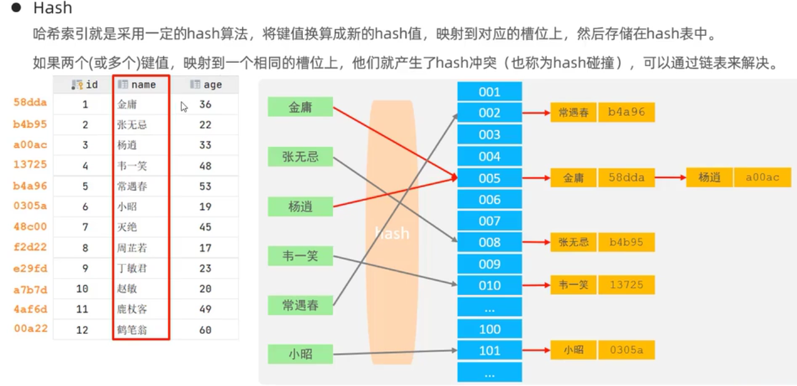
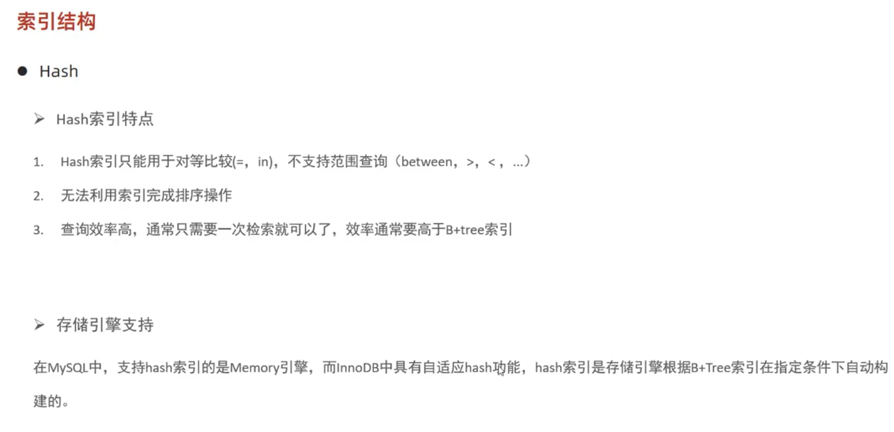

### hash 结构
#### 简介

> 将键值换算成新的 hash 值，映射到对应的槽位上，然后存储到 hash 表中。
#### hash 索引特点

特点：
1. `hash` 索引只能用于对等比较（=、in），不支持范围查询（between、>、<...）；
2. 无法利用索引完成排序操作；
3. 查询效率高；通常只需要一次检索就可以完成，效率通常要高于 `B+tree` 索引；

#### 存储引擎支持情况
目前只有 `memory` 存储引擎支持。