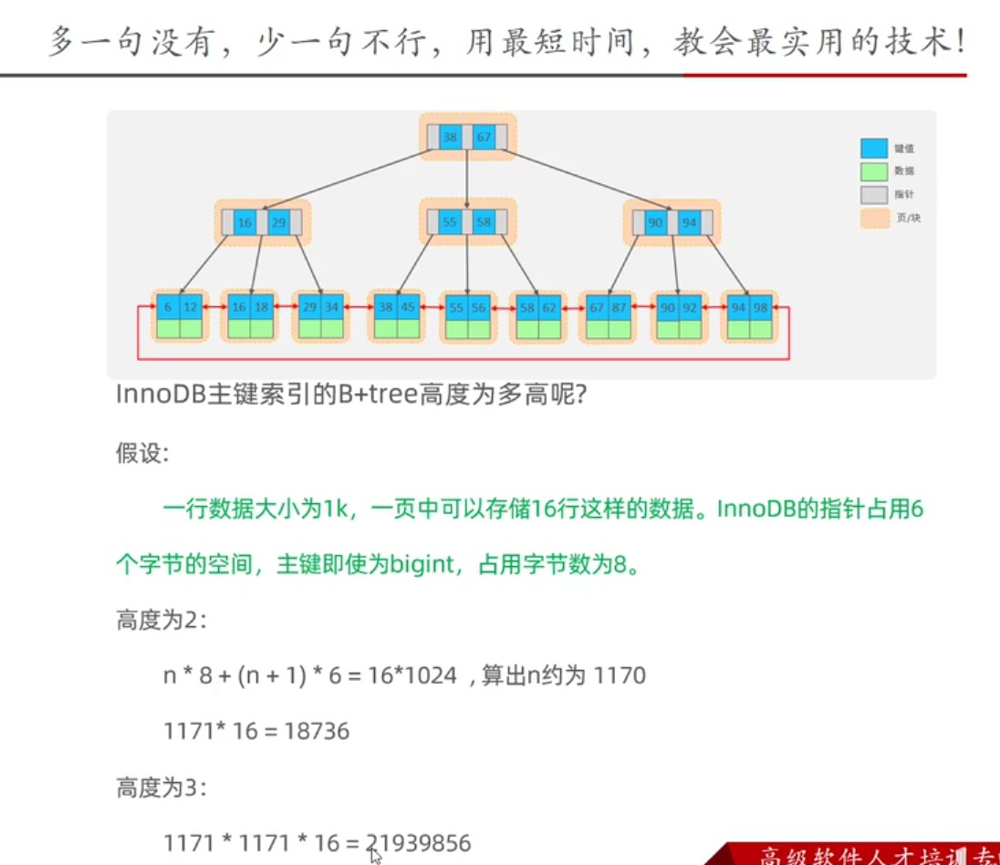

# 思考题
## 思考题一
以下SQL语句，那个执行效率高?为什么?
1. select * from user where id =10;
2. select * from user where name ='Arm' ;

注：id为主键，name字段创建的有索引;

## 思考题二

思考题二：高度为 2 的 B+Tree 最多能存储多少条数据？
假设：
- 一行数据大小为 1 k；
- 一页中可以存储 16 行这样的数据；
- InnoDB 的指针占用 6 个字节的空间；
- 主键的数据类型为 bigint，占用字节数为 8；
- 假如一个叶子节点有 n 个 key，就会有 n+1 个指针；
- 1 k = 1024 个字节。

设非叶子节点最多可以存储 n 个 key，则有：
n * 8 + (n+1) * 6 = 16 * 1024
=> n 约等于 1170。
换句话说，高度为 2 的 B+Tree 
- 最多存储 1170 个 key；
- 最多存储 1171 个指针；（指针比 key 多一个）
- 最多有 1171 个叶子节点（一个指针指向一个叶子节点）；
- 最多可以存储 1171 * 16 = 18736 条记录。

高度为 3 时同理，最多可以存储（枚举）：
1171 * 1171 * 16 = 21939856 
